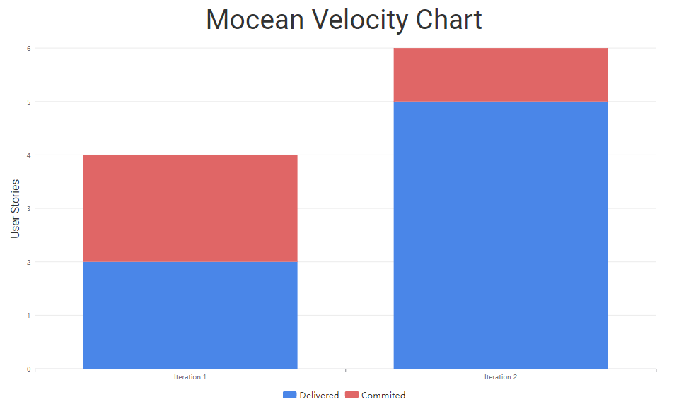

# Mocean Retrospective 3 

## Part of Project Not as Successful:

### Food Tracking and General Bugs:

The app experienced crashes with the creation of food items as we did not insure that values which were too large were not allowed, this was an oversight and we will fix this by sanitizing the inputs.

There were issues with saving food items in the database as we were not passing the input of the food group as we had hardcoded it initially and forgot about it, this was also an oversight and we will fix this by passing the correct value to the handler.

### Workout Database Implementation: 

We had issues with the database implementation and associated logic between workouts and exercises that caused us to miss the due date of having workout tracking fully implemented in iteration 2. We will rework the workout database implementation to ensure it supports the workout tracking feature.

### Testing: 

The test code coverage was subpar, we dropped the ball on implementing tests and had failing tests in our submission, the latter was caused due to issues when merging our branches down on the due date and we scrambled to attempt to resolve the issues. We will improve this by fixing the current tests and implementing new tests to have better code coverage.

## Improvement Plan and Success evaluation:

### Bug Fixing:

We are going to devote significant time to identify and fix bugs in the food tracking and workout database implementation.

We want the number of reported bugs to significantly decrease, and the app should be stable with all expected functionalities working as intended. This will be measured a success if there are 0 bugs with our program and all functionality works as intended.

### Workout Database Implementation:

We will fix the linking of the data between workouts and exercises and also fix the associated logic to feed the front end with the correct data.

The workout tracking feature should be fully functional, allowing users to track and view their workouts seamlessly.

### Refactoring and Test Coverage:

We want to perform lots of refactoring to eliminate SOLID violations and improve code quality. We also want to increase test coverage and fix failing tests, we will do this by spending more time writing tests and fixing the current ones so that they work correctly.

We will call this a success if the codebase adheres to SOLID principles, and test coverage is greater than last iteration, we will aim for 90-100% code coverage. 

### Overall, our goal is to have a well-functioning app that is intuitive, easy to use, and provides smooth tracking functions for all users by the end of this iteration.

### Velocity Chart

